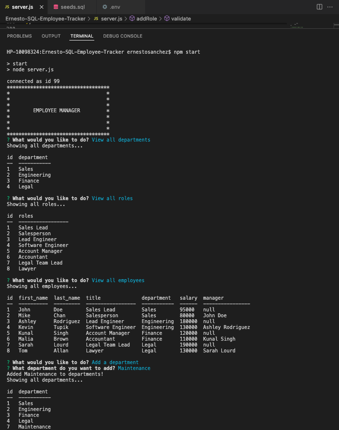
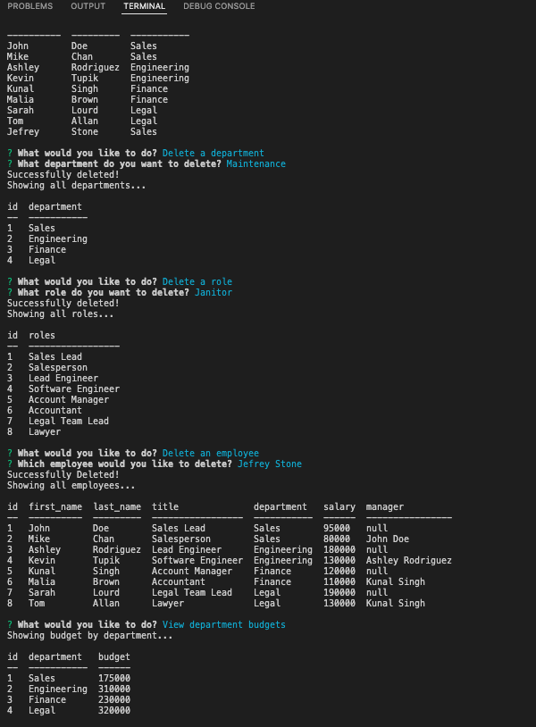

# SQL Employee Tracker Database

[](https://opensource.org/licences/MIT)

## Description

Developers frequently have to create interfaces that allow non-developers to easily view and interact with information stored in databases. These interfaces are called content management systems (CMS). This command-line application manages a company's employee database, using Node.js, Inquirer, and MySQL.

## Table of Contents

-   [User Story](#userstory)
-   [Demo Video](#demovideo)
-   [Screen Shots](#screenshots)
-   [Installation](#installation)
-   [Usage](#usage)
-   [License](#license)
-   [Contributing](#contributing)
-   [Tests](#tests)
-   [Questions](#questions)

## User Story

AS A business owner I WANT to be able to view and manage the departments, roles, and employees in my company SO THAT I can organize and plan my business

## Demo Video

[WATCH DEMO VIDEO HERE!](https://drive.google.com/file/d/1MK8oRQEHQ627ola3irkPpExFnbll8GIE/view?usp=sharing)

## Screenshots




## Installation

This project uses 4 npm packages:

```
npm i
```

```
npm i inquirer
```

```
npm i mysql2
```

```
npm i dotenv
```

```
npm i inquirer
```

## Usage

To run the app, run the following command:

```
npm start
```

## License

    License is MIT standard license.

## Contributing

It is an open project and everyone can contribute - please send and email requesting to be added as a contributor

## Tests

There is no testing required

## Questions

If you have any questions about the repo, open an issue or contact [ernestosanchezCS](https://github.com/ernestosanchezCS/) directly at ernestosanchez8888@gmail.com.
